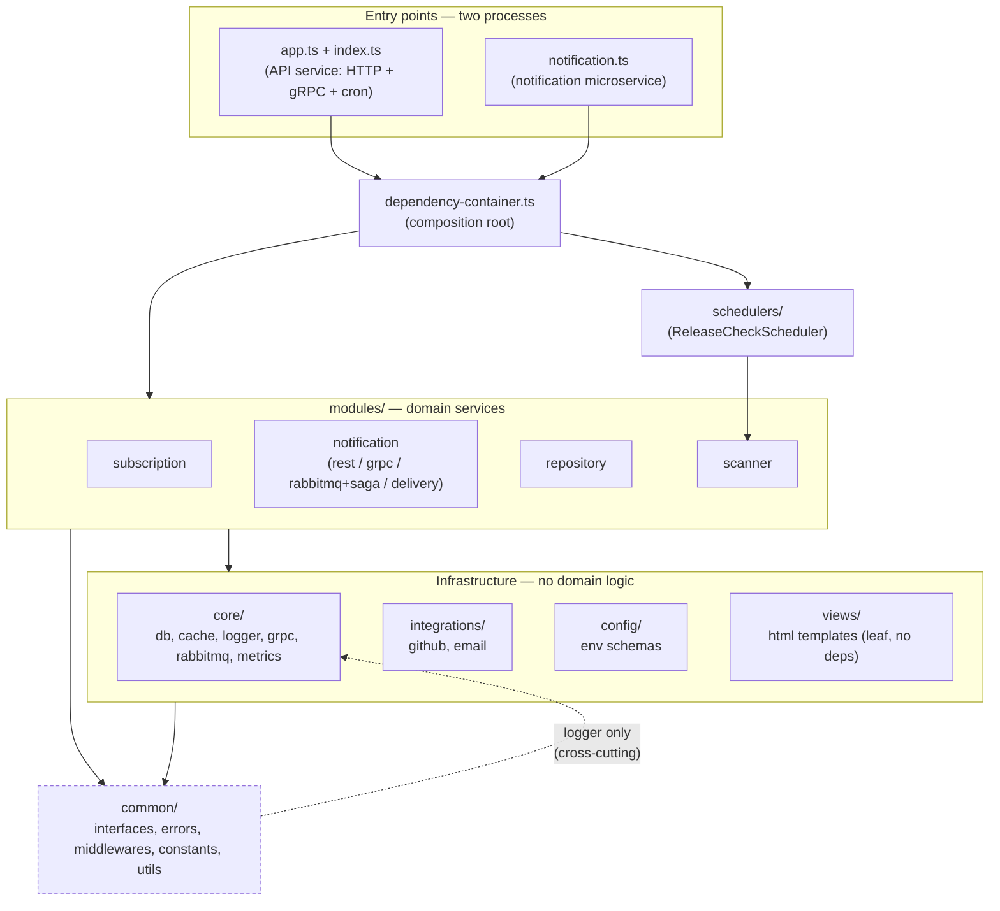

# Architecture — Layers and Dependency Rules

This document describes the layered structure of the codebase and the automated rules that
enforce it. See `docs/system-design.md` for the functional/runtime view (endpoints, data model,
sequence diagrams); this document is about *module boundaries*.

## Layer diagram

`common/` is the innermost layer: everything may depend on it, it depends on nothing domain- or
infrastructure-specific. `core/`, `integrations/`, `config/` and `views/` sit above it and know
nothing about `modules/`. `modules/*` are the domain services and are the only layer allowed to
depend on other modules' infrastructure providers. `schedulers/` and the composition root
(`dependency-container.ts` + the two entry points `app.ts`/`index.ts` and `notification.ts`) sit on
top, wiring everything together for the two deployable processes.

### Roles

| Layer | Role |
| --- | --- |
| `common/` | Cross-module contracts (`interfaces/*`: `ConfirmationPort`, `ReleaseNotificationPort`, `MessagePublisher`, `MessageHandler`), errors, middlewares, constants, utils. |
| `core/` | Generic infrastructure/transport with zero domain logic: `db/`, `cache/`, `logger/`, `grpc/` (generic server + error mapper), `rabbitmq/` (generic `RabbitConsumer`/`RabbitMessagePublisher`), `metrics/`. |
| `integrations/` | Outbound adapters to third parties: `github/`, `email/`. |
| `config/` | Env schema validation, no imports from `core/`/`modules/`. |
| `views/` | Pure HTML template helpers (`escapeHtml`, `renderHtmlMessage`) — a dependency-free leaf used by both `common/` and `modules/`. |
| `modules/{subscription,notification,repository,scanner}/` | Domain services, each with its own controllers/entities/repository/providers. `notification/` exposes three transports (`rest/`, `grpc/`, `rabbitmq/` incl. `saga/`) plus `delivery/` (the email channel). |
| `schedulers/` | `ReleaseCheckScheduler` — periodic job that drives `scanner`, instantiated by the composition root. |
| `dependency-container.ts`, `app.ts`/`index.ts`, `notification.ts` | Composition root and the two process entry points (API service, notification microservice). |

## Documented exceptions

These are intentional, allowed by the rules below rather than accidental violations:

1. **`common/middlewares/error.middleware.ts` → `core/logger`.** Logging is treated as a
   cross-cutting concern available from any layer, unlike domain-specific infrastructure
   (rabbitmq/grpc/db). Only `core/logger` is exempted from `no-common-to-core` — every other
   `core/*` subpath is still off-limits to `common/`.
2. **`modules/subscription/saga/subscription-saga.orchestrator.ts` → `modules/notification/rabbitmq/saga/saga.contract.ts`
   (type-only).** The orchestrator must know the shape of the event it compensates on. This is the
   only allowed crossing between the `subscription` and `notification` modules, and it's
   restricted to `import type` — a runtime (value) import in either direction is a violation.

No other cross-module or layer-inversion imports exist in the codebase (`core → modules` and
`common → modules` are both clean).

## Enforcement

Layering is checked with [dependency-cruiser](https://github.com/sverweij/dependency-cruiser),
configured in `.dependency-cruiser.cjs`:

- `npm run arch:check` — runs the ruleset against `src/` and exits non-zero on any `error`-level
  violation (the two rules above plus `no-circular`). Wired into CI (`.github/workflows/lint.yml`)
  right after `npm run lint`.
- `npm run arch:graph` — regenerates `docs/architecture-graph.mmd`, the full as-built import graph
  (every file, every edge), as opposed to the hand-drawn layer summary above. Re-run it whenever
  the module structure changes.

`no-orphans` also runs, but at `warn` severity only — it flags interface files that are only ever
referenced via `import type` (e.g. `ConfirmationPort`, `MessageHandler`) as orphans, since those
imports are erased at compile time and leave the file with no runtime dependents. That's expected
given this codebase's interface-segregation style, not a real problem, so it doesn't fail the
build.
