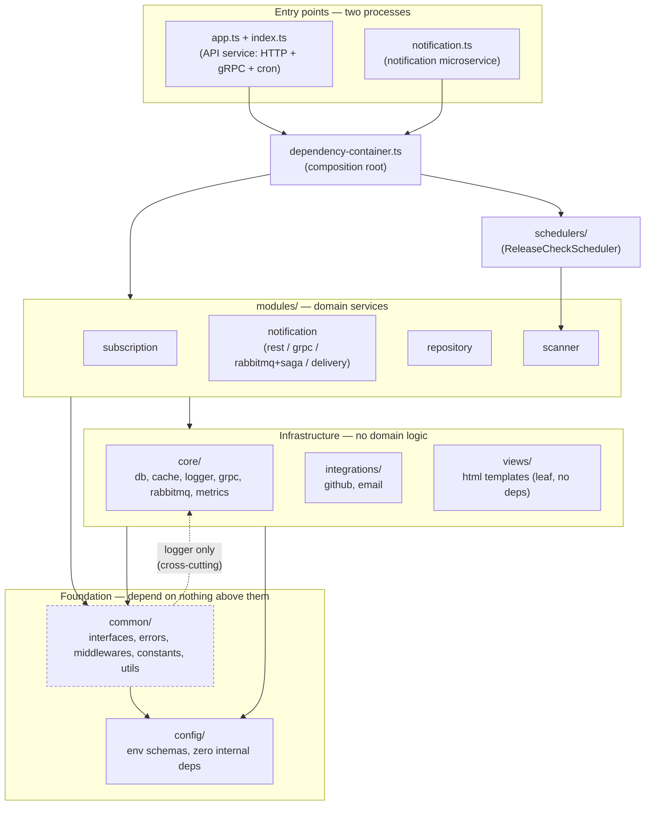

# Architecture — Layers and Dependency Rules

This document describes the layered structure of the codebase and the automated rules that
enforce it. See `docs/system-design.md` for the functional/runtime view (endpoints, data model,
sequence diagrams); this document is about *module boundaries*.

## Layer diagram

`config/` is the true innermost layer: it depends on nothing internal, only env vars and
third-party packages. `common/` sits beside it as the other foundational piece — everything may
depend on `common/`, and `common/` itself depends on `config/` (a couple of middlewares read
`config.API_KEY` / `config.NODE_ENV` directly) plus the one `core/logger` exception below. `core/`,
`integrations/` and `views/` sit above the foundation: they read `config/` directly for connection
settings (DB/Redis/gRPC clients, the GitHub HTTP client) and know nothing about `modules/`.
`modules/*` are the domain services and are the only layer allowed to depend on other modules'
infrastructure providers. `schedulers/` and the composition root (`dependency-container.ts` + the
two entry points `app.ts`/`index.ts` and `notification.ts`) sit on top, wiring everything together
for the two deployable processes.

### Roles

| Layer | Role |
| --- | --- |
| `config/` | Env schema validation. Zero internal dependencies — only `zod`, `dotenv` and sibling `config/*` files. Read directly by `core/`, `integrations/` and `common/`; `modules/*` never import it directly and get values injected by the composition root instead. |
| `common/` | Cross-module contracts (`interfaces/*`: `ConfirmationPort`, `ReleaseNotificationPort`, `MessagePublisher`, `MessageHandler`), errors, middlewares, constants, utils. Reads `config/` directly (`api-key.middleware.ts`, `error.middleware.ts`). |
| `core/` | Generic infrastructure/transport with zero domain logic: `db/`, `cache/`, `logger/`, `grpc/` (generic server + error mapper), `rabbitmq/` (generic `RabbitConsumer`/`RabbitMessagePublisher`), `metrics/`. |
| `integrations/` | Outbound adapters to third parties: `github/`, `email/`. |
| `views/` | Pure HTML template helpers (`escapeHtml`, `renderHtmlMessage`) — a dependency-free leaf used by both `common/` and `modules/`. |
| `modules/{subscription,notification,repository,scanner}/` | Domain services, each with its own controllers/entities/repository/providers. `notification/` exposes three transports (`rest/`, `grpc/`, `rabbitmq/` incl. `saga/`) plus `delivery/` (the email channel). |
| `schedulers/` | `ReleaseCheckScheduler` — periodic job that drives `scanner`, instantiated by the composition root. |
| `dependency-container.ts`, `app.ts`/`index.ts`, `notification.ts` | Composition root and the two process entry points (API service, notification microservice). |

## Documented exceptions

These are intentional, allowed by the rules below rather than accidental violations. (`common/`'s
dependency on `config/` is *not* one of these — `config/` is foundational, so nothing forbids
reading it; see the diagram and roles table above.)

1. **`common/middlewares/error.middleware.ts` → `core/logger`.** Logging is treated as a
   cross-cutting concern available from any layer, unlike domain-specific infrastructure
   (rabbitmq/grpc/db). Only `core/logger` is exempted from `no-common-to-core` — every other
   `core/*` subpath is still off-limits to `common/`.
2. **`modules/subscription/saga/subscription-saga.orchestrator.ts` → `modules/notification/rabbitmq/saga/saga.contract.ts`
   (type-only).** The orchestrator must know the shape of the event it compensates on. This is the
   only actual crossing between domain modules today, and it's restricted to `import type` — a
   runtime (value) import between any two of `subscription`/`notification`/`repository`/`scanner`
   is a violation.

No other cross-module or layer-inversion imports exist in the codebase — `no-infra-to-modules`
(`core`/`integrations`/`config`/`views` → `modules`), `no-common-to-modules` and
`no-config-to-other-layers` are all clean.

## Enforcement

Layering is checked with [dependency-cruiser](https://github.com/sverweij/dependency-cruiser),
configured in `.dependency-cruiser.cjs`:

- `npm run arch:check` — runs the ruleset against `src/` and exits non-zero on any `error`-level
  violation: the five boundary rules (`no-infra-to-modules`, `no-common-to-modules`,
  `no-common-to-core`, `no-config-to-other-layers`, `no-cross-module-value-imports`) plus
  `no-circular`. Wired into CI (`.github/workflows/lint.yml`) right after `npm run lint`.
- `npm run arch:graph` — regenerates `docs/architecture-graph.mmd`, the full as-built import graph
  (every file, every edge), as opposed to the hand-drawn layer summary above. Re-run it whenever
  the module structure changes.

`no-orphans` also runs, but at `warn` severity only. Most of what it flags is type-only files —
interface and entity files referenced solely via `import type` (e.g. `ConfirmationPort`,
`MessageHandler`, `subscription.entity.ts`) — whose imports are erased at compile time, leaving no
runtime dependents. That's expected given this codebase's interface-segregation style, so it
doesn't fail the build. A *non*-type-only file surfacing here instead signals genuinely dead code:
currently `modules/notification/rabbitmq/rabbitmq.provider.ts` (`RabbitMqProvider`) is such an
orphan, left unwired after release notifications moved from the RabbitMQ queue to a direct gRPC
call — a cleanup candidate rather than a boundary violation.
