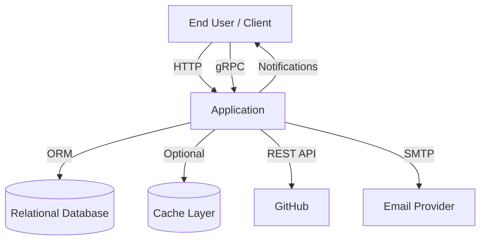
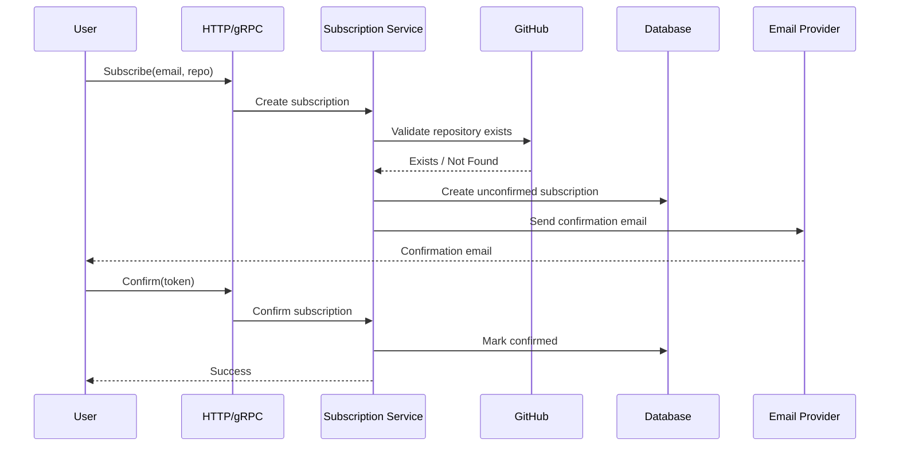
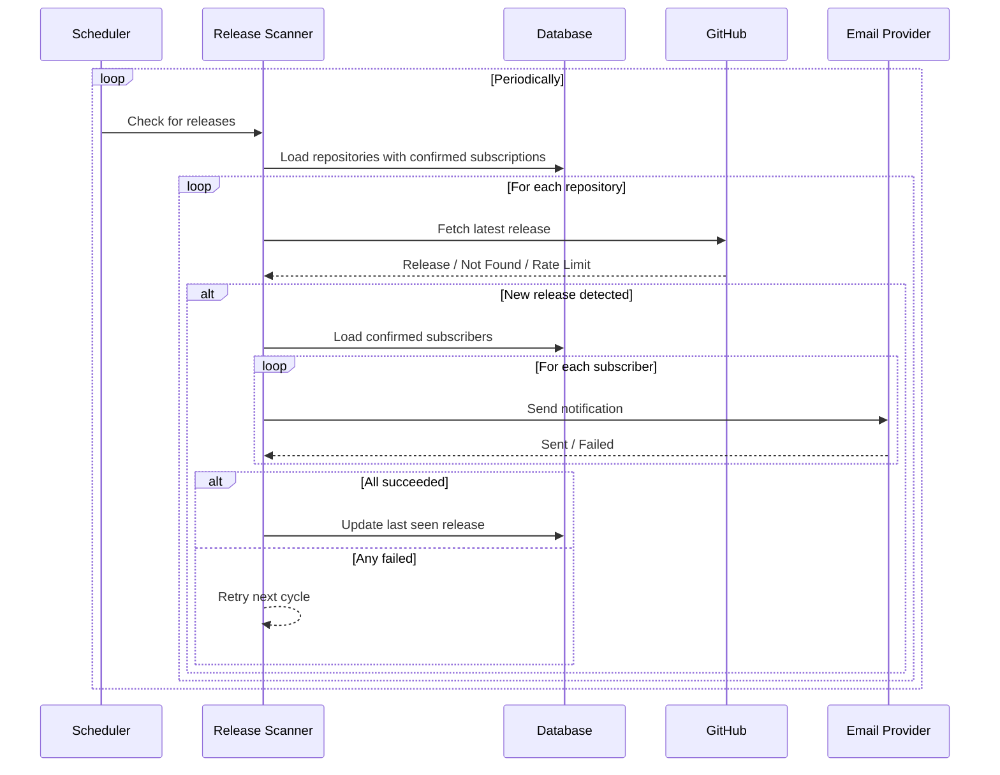

# System Design Document — GitHub Release Notifier

## 1. Introduction

### Purpose
Define the architecture and runtime behavior of the GitHub Release Notifier service.

### Scope
This document covers:

- HTTP API and public web routes
- gRPC API
- Background release scanner
- Persistence layer
- Caching strategy
- Email delivery
- Operational metrics and health checks

---

## 2. Requirements

### Functional Requirements

1. Users can subscribe an email to a GitHub repository.
2. Subscription must be confirmed via a token link sent by email.
3. Users can unsubscribe via token link.
4. Confirmed subscriptions can be listed by email.
5. The system checks repositories for new releases.
6. On new release, confirmed subscribers receive notification emails.

### Non-Functional Requirements

- Keep infrastructure simple (single service + standard dependencies).
- Maintain service operation if the caching layer is unavailable.
- Protect programmatic API access with an API key.
- Expose operational metrics and health checks.

---

## 3. Architecture Overview

### Architecture Style
Single-process application with internal modules and background task scheduling.

### Technology Stack

| Layer | Technology |
| --- | --- |
| Runtime | Node.js + TypeScript |
| HTTP Transport | Express framework |
| RPC Transport | gRPC |
| Validation | Zod |
| Persistence | ORM with relational database |
| Task Scheduling | In-process scheduler |
| Email Delivery | SMTP provider |
| Caching | Optional distributed cache |
| Monitoring | Prometheus metrics |

### High-Level Context

### Internal Modules

- `modules/subscription` — subscription business logic (REST/gRPC/web controllers)
- `modules/notification` — notification delivery across three transports: `rest/`, `grpc/`,
  `rabbitmq/` (incl. `saga/`), plus the `delivery/` email channel
- `modules/repository` — repository persistence
- `modules/scanner` — release detection and dispatch
- `core` — generic infrastructure: `db`, `cache`, `logger`, `grpc` server, `rabbitmq` transport,
  `metrics`
- `integrations` — outbound adapters to third parties: `github`, `email`
- `config` — environment schema validation
- `schedulers` — periodic release-check job
- `views` — HTML template helpers for the public web routes
- `common` — cross-module contracts, errors, middleware, constants, shared utilities

See `docs/architecture.md` for the full layer diagram and the automatically enforced dependency
rules.

---

## 4. API & Interface Design

### HTTP Endpoints

**System**
- `GET /health`
- `GET /metrics`

**Protected API (`x-api-key` required)**
- `POST /api/subscribe`
- `GET /api/confirm/:token`
- `GET /api/unsubscribe/:token`
- `GET /api/subscriptions`

**Public Web Routes**
- `POST /web/subscribe` (rate-limited)
- `GET /web/confirm/:token`
- `GET /web/unsubscribe/:token`

### gRPC Service
Service: `release_notifier.ReleaseNotifier`

- `Subscribe`
- `Confirm`
- `Unsubscribe`
- `GetSubscriptions`

All gRPC methods require metadata key `x-api-key`.

---

## 5. Data Model

### Relational Schema

The system persists two primary entities:

| Entity | Purpose |
| --- | --- |
| `repositories` | Tracks monitored repositories and last processed release |
| `subscriptions` | Stores subscription lifecycle (pending/confirmed) and user tokens |

Constraints:

- One subscription per (email, repository) pair.
- Subscriptions reference repositories with cascade delete.

---

## 6. Core Runtime Flows

### 6.1 Subscribe + Confirm Flow

### 6.2 Release Detection and Notification Flow

---

## 7. Caching & External Integrations

### GitHub Integration

The application integrates with GitHub to verify repository information and retrieve release metadata.

Rate-limit responses are mapped to internal contract errors.

### Cache Strategy

- **Cache Abstraction:** Unified interface for cache operations.
- **Primary Backend:** Distributed cache system (if configured and reachable).
- **Fallback Backend:** In-memory no-op implementation.
- **TTL:** Configurable via environment variables.
- **Cached Objects:** Repository verification and release metadata.

This design ensures the application remains operational during cache layer degradation.

---

## 8. Security Model

### Access Control

- Protected API routes are secured by explicit API key validation.
- All remote procedure calls validate API key from metadata headers.
- Public subscription creation is rate-limited per identifier.
- User-initiated verification actions rely on secure token lookup.

### Input Validation

- Incoming payloads and query parameters are validated at the transport boundary.
- Validation errors are returned as structured bad request responses.

---

## 9. Error Handling, Metrics, and Operations

### Error Handling

- Domain errors use predefined application errors and explicitly typed subclasses.
- External integration errors are gracefully mapped to clean, transport-agnostic responses.
- Unhandled errors default to standard internal server error responses.

### Metrics & Health

- Dedicated health endpoint exposes internal system liveness state.
- Metrics endpoint exposes operational runtime data including request frequency and latency.

### Scheduler Operations

- Scheduler parameters are verified during application bootstrap.
- Scheduler initializes during startup and shuts down gracefully.
- Graceful shutdown ensures all active connections are properly closed.

---

## 10. Testing Strategy

### Test Pyramid in This Project

- **Unit tests** cover core business logic and integration boundaries with mocked external services.
- **Integration tests** cover API transports (HTTP and gRPC) and application wiring.

### Tooling and Execution

- Tests run in isolation to ensure environment stability.
- Test initialization configures shared test doubles and environment parameters.

### What Is Verified

- Request validation and error mapping across transports.
- API key enforcement for REST and gRPC interfaces.
- Subscription lifecycle rules (create/confirm/unsubscribe/list).
- Release detection logic and state update behavior.
- Cache and external integration boundaries via mocks.

---

## 11. Deployment View

### Current Deployment Environment

The production service runs in a containerized infrastructure on a single managed instance.

### Local/Container Deployment

The deployment orchestration includes:

- The main application service
- The relational database
- The optional cache system

Application initialization sequence:

1. Load and validate environment configuration.
2. Initialize HTTP and gRPC servers.
3. Start background scheduler.

---

## 12. Design Constraints and Tradeoffs

### Current Tradeoffs

1. **In-process scheduler** keeps complexity low but can result in duplicate execution in multi-instance environments without distributed coordination.
2. **Sequential notification delivery** simplifies implementation and provides backpressure control but limits throughput under high subscriber loads.
3. **Volatile task state** avoids persistent state storage complexity but relies on periodic retries rather than explicit state tracking.
4. **At-least-once notification semantics** prioritize guaranteed delivery over strict single-delivery but risk duplicate messages if cycles are interrupted.
5. **Best-effort cache** prioritizes availability over consistency, accepting degraded performance during cache outages.
6. **Split auth model** secures service-to-service interfaces while providing frictionless user experiences, at the cost of expanded testing surface.

### Future Evolution Paths

- Add distributed job coordination for horizontal scaling scenarios.
- Introduce persistent message queue for stronger delivery guarantees.
- Implement explicit retry policies with backoff and attempt tracking.