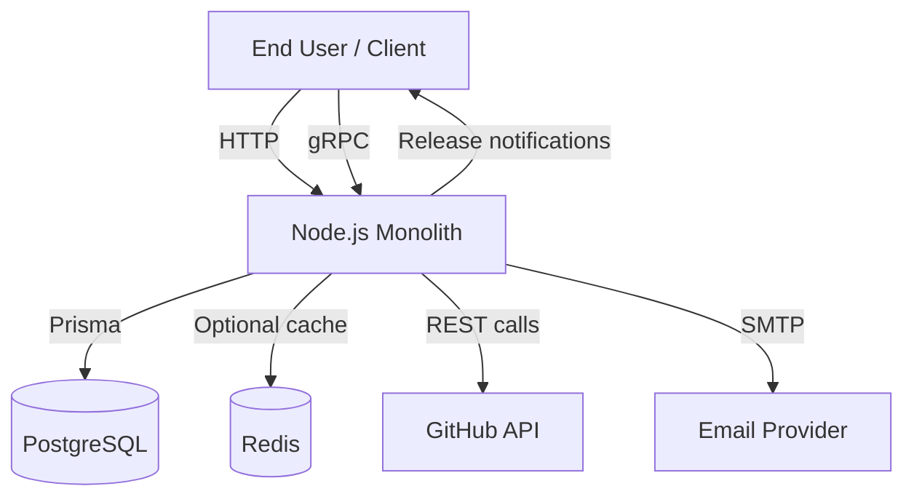
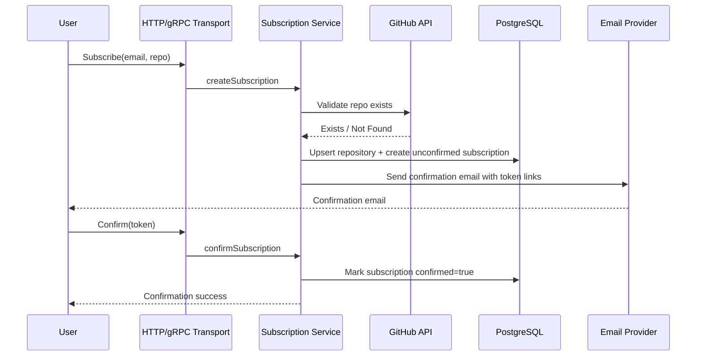
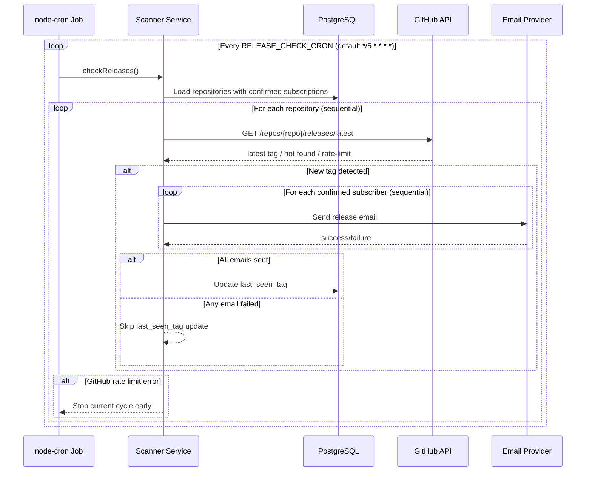

# System Design Document — GitHub Release Notifier

## 1. Introduction

### Purpose
Define the architecture and runtime behavior of the GitHub Release Notifier service, based on the current implementation in `main`.

### Scope
This document covers:

- HTTP API and public web routes
- gRPC API
- Background release scanner
- PostgreSQL persistence
- Optional Redis cache
- Email delivery
- Metrics and deployment model

### Out of Scope

- User account system (password/JWT/session-based auth)
- Message broker / worker architecture
- Multi-region or multi-service orchestration

---

## 2. Requirements

### Functional Requirements

1. Users can subscribe an email to a GitHub repository (`owner/repo`).
2. Subscription must be confirmed via a token link sent by email.
3. Users can unsubscribe via token link.
4. Confirmed subscriptions can be listed by email.
5. A scheduled job checks repositories for new releases.
6. On new release, confirmed subscribers receive notification emails.

### Non-Functional Requirements

- Keep infrastructure simple (single service + standard dependencies).
- Maintain service operation if Redis is unavailable.
- Protect programmatic API access with API key.
- Expose operational metrics and health endpoint.

---

## 3. Architecture Overview

### Architecture Style
Single Node.js monolith with internal modules and in-process scheduler.

### Technology Stack

| Layer | Technology |
| --- | --- |
| Runtime | Node.js + TypeScript |
| HTTP | Express 5 |
| RPC | gRPC (`@grpc/grpc-js`) |
| Validation | Zod |
| Persistence | PostgreSQL + Prisma |
| Scheduler | `node-cron` |
| Email | Nodemailer (Gmail SMTP) |
| Cache | Redis (optional) |
| Metrics | Prometheus (`prom-client`) |

### High-Level Context

### Internal Modules

- `subscription` — create/confirm/unsubscribe/list business logic
- `github` — GitHub API integration
- `repository` — repository persistence operations
- `notification` — email sending
- `scanner` — scheduled release checks
- `grpc` — gRPC server and handlers
- `common` — cache, errors, middleware, metrics, shared utils

---

## 4. API & Interface Design

### HTTP Endpoints

**System**
- `GET /health`
- `GET /metrics`

**Protected REST API (`x-api-key` required)**
- `POST /api/subscribe`
- `GET /api/confirm/:token`
- `GET /api/unsubscribe/:token`
- `GET /api/subscriptions?email=...`

**Public Web Routes**
- `POST /web/subscribe` (rate-limited)
- `GET /web/confirm/:token`
- `GET /web/unsubscribe/:token`

### gRPC Service
Service: `release_notifier.ReleaseNotifier`

- `Subscribe`
- `Confirm`
- `Unsubscribe`
- `GetSubscriptions`

All gRPC methods require metadata key `x-api-key`.

---

## 5. Data Model

### Relational Schema (PostgreSQL)

| Table | Key Fields | Purpose |
| --- | --- | --- |
| `repositories` | `id`, `full_name` (unique), `last_seen_tag`, `updated_at` | Tracks monitored GitHub repositories and last processed release tag |
| `subscriptions` | `id`, `email`, `confirmed`, `confirmation_token` (unique), `unsubscribe_token` (unique), `repository_id` | Stores subscription lifecycle and user tokens |

Constraints:

- One active subscription record per pair: `(email, repository_id)` (unique).
- `subscriptions.repository_id` references `repositories.id` with cascade delete.

---

## 6. Core Runtime Flows

### 6.1 Subscribe + Confirm Flow

### 6.2 Scheduled Release Scan Flow

---

## 7. Caching & External Integrations

### GitHub Integration

GitHub calls are made via:

- `GET /repos/{owner}/{repo}` (repository existence)
- `GET /repos/{owner}/{repo}/releases/latest` (latest release tag)

Rate-limit style errors are mapped to internal `RateLimitError`.

### Cache Strategy

- Cache abstraction: `cacheService`.
- Primary backend: Redis (if configured and reachable).
- Fallback backend: `nullCache` (no-op).
- TTL: `GITHUB_CACHE_TTL_SECONDS` (default `600`).
- Cached objects include repository info and latest release responses.

This keeps the app operational even when Redis is down, with degraded cache efficiency.

---

## 8. Security Model

### Access Control

- `/api/*` routes are protected by `x-api-key`.
- All gRPC methods validate `x-api-key` from metadata.
- `/web/subscribe` is public but rate-limited (`5` requests / `15` minutes / IP).
- `/web/confirm/:token` and `/web/unsubscribe/:token` rely on one-time token lookup.

### Input Validation

- Request payloads and params are validated with Zod.
- Validation errors are returned as structured HTTP 400 responses.

---

## 9. Error Handling, Metrics, and Operations

### Error Handling

- Domain errors use `AppError` and typed subclasses (`NotFoundError`, `ConflictError`, etc.).
- Prisma known errors are mapped to API-friendly responses.
- Unknown errors return HTTP 500.

### Metrics & Health

- `/health` for liveness checks.
- `/metrics` exposes Prometheus metrics.
- HTTP metrics include request count and latency histogram.

### Scheduler Operations

- Cron schedule is validated at startup.
- Job is initialized during bootstrap and stopped during graceful shutdown.
- Graceful shutdown also closes HTTP and gRPC servers.

---

## 10. Deployment View

### Local/Container Deployment

`docker-compose.yml` runs:

- `app` (Node.js service)
- `postgres` (PostgreSQL 15)
- `redis` (Redis 7)

App startup sequence:

1. Environment is loaded and validated.
2. HTTP server starts.
3. gRPC server starts.
4. Release-check cron job is initialized.

---

## 11. Design Constraints and Tradeoffs

### Current Tradeoffs

1. **In-process scheduler** keeps complexity low, but multi-instance deployments can run duplicate jobs.
2. **No durable queue** means retries happen on later cron cycles, not via persistent task state.
3. **Best-effort cache** preserves uptime but does not guarantee cache availability.
4. **Split auth model** (API key + token links) improves UX and machine security, but increases documentation/testing surface.

### Future Evolution Paths

- Add distributed job coordination if horizontal scaling becomes required.
- Introduce durable notification queue for stronger delivery guarantees.
- Add delivery retry/backoff policy with explicit attempt tracking.

