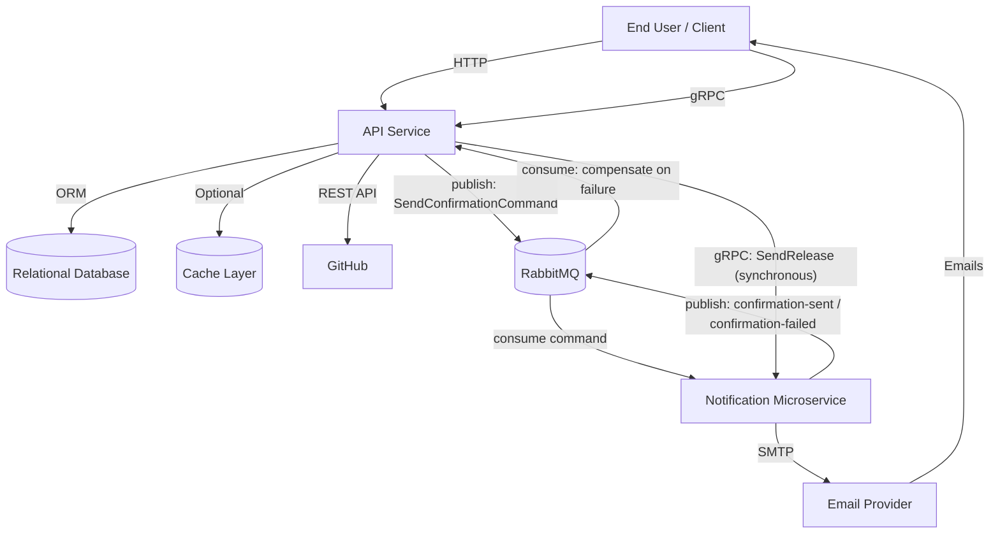
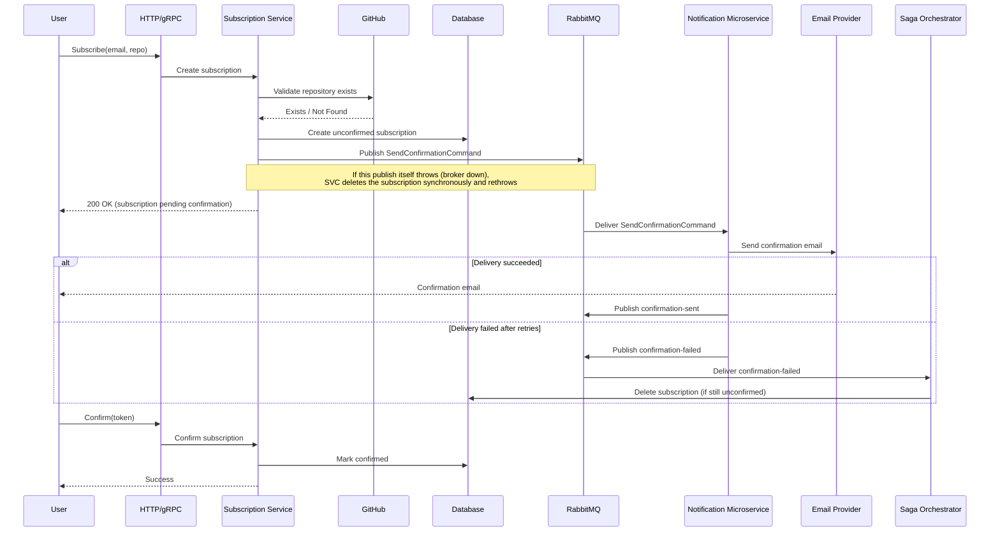
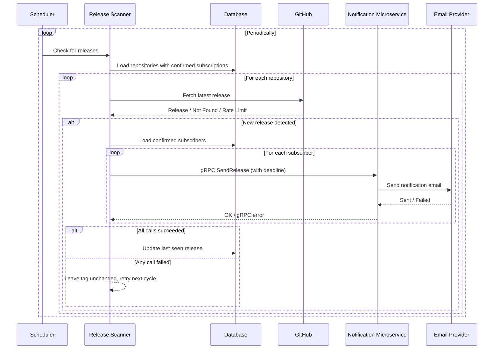

# System Design Document — GitHub Release Notifier

## 1. Introduction

### Purpose
Define the architecture and runtime behavior of the GitHub Release Notifier service.

### Scope
This document covers:

- HTTP API and public web routes
- gRPC API
- Background release scanner
- Persistence layer
- Caching strategy
- Email delivery
- Operational metrics and health checks

---

## 2. Requirements

### Functional Requirements

1. Users can subscribe an email to a GitHub repository.
2. Subscription must be confirmed via a token link sent by email.
3. Users can unsubscribe via token link.
4. Confirmed subscriptions can be listed by email.
5. The system checks repositories for new releases.
6. On new release, confirmed subscribers receive notification emails.

### Non-Functional Requirements

- Keep infrastructure lean (two focused services + standard dependencies, no unnecessary moving parts).
- Maintain service operation if the caching layer is unavailable.
- Protect programmatic API access with an API key.
- Expose operational metrics and health checks.

---

## 3. Architecture Overview

### Architecture Style
Two cooperating services, not a single process: an **API service** (HTTP + gRPC + in-process cron
scheduler) that owns subscriptions and release detection, and a **notification microservice** that
owns email delivery. They talk over two channels, each chosen for its flow: subscription
**confirmations** go through a RabbitMQ command/event saga with compensation on delivery failure,
while **release notifications** are a synchronous gRPC call from the scanner into the notification
service. See `docs/architecture.md` for the module-level layer diagram.

### Technology Stack

| Layer | Technology |
| --- | --- |
| Runtime | Node.js + TypeScript |
| HTTP Transport | Express framework |
| RPC Transport | gRPC (client-facing subscription API, and API-to-notification release calls) |
| Message Broker | RabbitMQ (confirmation saga: command + event queues, compensation) |
| Validation | Zod |
| Persistence | ORM with relational database |
| Task Scheduling | In-process scheduler (API service only) |
| Email Delivery | SMTP provider |
| Caching | Optional distributed cache |
| Monitoring | Prometheus metrics |

### High-Level Context

### Internal Modules

`modules/subscription`, `modules/scanner` and `modules/repository` run inside the **API service**
process (`app.ts` + `index.ts`). `modules/notification` runs inside the **notification
microservice** process (`notification.ts`), except for the saga orchestrator piece described below,
which lives in `modules/subscription` on the API service side.

- `modules/subscription` — subscription business logic (REST/gRPC/web controllers), plus
  `saga/subscription-saga.orchestrator.ts` which compensates (deletes the subscription) when the
  notification microservice reports a failed confirmation
- `modules/notification` — notification delivery across three interchangeable transports behind the
  notification ports: `grpc/` (the release path the API service currently calls via `SendRelease`),
  `rabbitmq/` (incl. `saga/` — the command handler that sends confirmation emails and reports
  success/failure back), and `rest/` (an HTTP adapter kept for comparison, not currently wired),
  plus the `delivery/` email channel
- `modules/repository` — repository persistence
- `modules/scanner` — release detection and dispatch (calls the notification microservice over
  gRPC via `GrpcNotificationProvider`; one synchronous call per subscriber)
- `core` — generic infrastructure: `db`, `cache`, `logger`, `grpc` server, `rabbitmq` transport,
  `metrics`
- `integrations` — outbound adapters to third parties: `github`, `email`
- `config` — environment schema validation
- `schedulers` — periodic release-check job (API service only)
- `views` — HTML template helpers for the public web routes
- `common` — cross-module contracts, errors, middleware, constants, shared utilities

See `docs/architecture.md` for the full layer diagram and the automatically enforced dependency
rules.

---

## 4. API & Interface Design

### HTTP Endpoints

**System**
- `GET /health`
- `GET /metrics`

**Protected API (`x-api-key` required)**
- `POST /api/subscribe`
- `GET /api/confirm/:token`
- `GET /api/unsubscribe/:token`
- `GET /api/subscriptions`

**Public Web Routes**
- `POST /web/subscribe` (rate-limited)
- `GET /web/confirm/:token`
- `GET /web/unsubscribe/:token`

### gRPC Services

**Client-facing** — `release_notifier.ReleaseNotifier` (API service):

- `Subscribe`
- `Confirm`
- `Unsubscribe`
- `GetSubscriptions`

All of these methods require metadata key `x-api-key`.

**Internal** — `notification.v1.NotificationService` (notification microservice), called by the API
service, not by end clients:

- `SendConfirmation`
- `SendRelease` — of these, `SendRelease` is the transport the composition root currently wires for
  release notifications (see §6.2); `SendConfirmation` is an alternative confirmation transport that
  stays available but is not selected, since confirmations run through the RabbitMQ saga instead.

The notification microservice also exposes `GET /health` and internal REST routes
(`POST /send-confirmation`, `POST /send-release`) mirroring the gRPC methods. Its REST, gRPC and
RabbitMQ transports are interchangeable adapters behind the same notification ports; the
composition root selects which are active, and the project keeps the others as reference
implementations for comparing communication styles.

---

## 5. Data Model

### Relational Schema

The system persists two primary entities:

| Entity | Purpose |
| --- | --- |
| `repositories` | Tracks monitored repositories and last processed release |
| `subscriptions` | Stores subscription lifecycle (pending/confirmed) and user tokens |

Constraints:

- One subscription per (email, repository) pair.
- Subscriptions reference repositories with cascade delete.

---

## 6. Core Runtime Flows

### 6.1 Subscribe + Confirm Flow

Subscription creation and the actual email send are decoupled by a saga: the API service creates
the subscription and hands off a command over RabbitMQ; the notification microservice does the
send and reports back success or failure; the API service compensates (deletes the subscription)
only on a reported failure.

### 6.2 Release Detection and Notification Flow

Unlike the confirmation flow, release notifications use a **synchronous gRPC call** rather than the
broker: the scanner calls `SendRelease` on the notification microservice once per subscriber and
waits for the result, so it learns the actual delivery outcome (not just an enqueue). Each call
carries a client-side deadline. There is no saga or compensation here — `lastSeenTag` is advanced
only when every call for a repository succeeds; if any call fails, the tag is left unchanged and
the whole repository is retried on the next cron cycle (at-least-once delivery).

---

## 7. Caching & External Integrations

### GitHub Integration

The application integrates with GitHub to verify repository information and retrieve release metadata.

Rate-limit responses are mapped to internal contract errors.

### Cache Strategy

- **Cache Abstraction:** Unified interface for cache operations.
- **Primary Backend:** Distributed cache system (if configured and reachable).
- **Fallback Backend:** In-memory no-op implementation.
- **TTL:** Configurable via environment variables.
- **Cached Objects:** Repository verification and release metadata.

This design ensures the application remains operational during cache layer degradation.

---

## 8. Security Model

### Access Control

- Protected API routes are secured by explicit API key validation.
- All remote procedure calls validate API key from metadata headers.
- Public subscription creation is rate-limited per identifier.
- User-initiated verification actions rely on secure token lookup.

### Input Validation

- Incoming payloads and query parameters are validated at the transport boundary.
- Validation errors are returned as structured bad request responses.

---

## 9. Error Handling, Metrics, and Operations

### Error Handling

- Domain errors use predefined application errors and explicitly typed subclasses.
- External integration errors are gracefully mapped to clean, transport-agnostic responses.
- Unhandled errors default to standard internal server error responses.

### Metrics & Health

- Dedicated health endpoint exposes internal system liveness state.
- Metrics endpoint exposes operational runtime data including request frequency and latency.

### Scheduler Operations

- Scheduler parameters are verified during application bootstrap.
- Scheduler initializes during startup and shuts down gracefully.
- Graceful shutdown ensures all active connections are properly closed.

---

## 10. Testing Strategy

### Test Pyramid in This Project

- **Unit tests** cover core business logic and integration boundaries with mocked external services.
- **Integration tests** cover API transports (HTTP and gRPC) and application wiring.

### Tooling and Execution

- Tests run in isolation to ensure environment stability.
- Test initialization configures shared test doubles and environment parameters.

### What Is Verified

- Request validation and error mapping across transports.
- API key enforcement for REST and gRPC interfaces.
- Subscription lifecycle rules (create/confirm/unsubscribe/list).
- Release detection logic and state update behavior.
- Cache and external integration boundaries via mocks.

---

## 11. Deployment View

### Current Deployment Environment

The production service runs in a containerized infrastructure on a single managed instance.

### Local/Container Deployment

The deployment orchestration (`docker-compose.yml`) includes two application services plus their
shared dependencies:

- The API service (`app`) and the notification microservice (`notification`), each built from its
  own Dockerfile
- RabbitMQ — carries the confirmation saga between the two services (releases go over gRPC directly)
- The relational database
- The optional cache system
- An observability stack (Elasticsearch, Kibana, Filebeat, Prometheus, Grafana) for logs and metrics

API service initialization sequence:

1. Load and validate environment configuration.
2. Initialize HTTP and gRPC servers.
3. Start background scheduler.
4. Start the RabbitMQ saga-event consumer.

Notification microservice initialization sequence:

1. Load and validate environment configuration.
2. Initialize the HTTP and gRPC servers (the gRPC server serves the API service's `SendRelease` calls).
3. Start the RabbitMQ consumers: the confirmation-command queue used by the saga, and a plain
   notification-queue consumer that pairs with the plain-RabbitMQ transport, kept available even
   though the API service currently drives releases over gRPC.

---

## 12. Design Constraints and Tradeoffs

### Current Tradeoffs

1. **In-process scheduler** keeps complexity low but can result in duplicate execution in multi-instance environments without distributed coordination.
2. **Sequential notification delivery** simplifies implementation and provides backpressure control but limits throughput under high subscriber loads.
3. **Volatile task state** avoids persistent state storage complexity but relies on periodic retries rather than explicit state tracking.
4. **At-least-once notification semantics** prioritize guaranteed delivery over strict single-delivery but risk duplicate messages if cycles are interrupted.
5. **Best-effort cache** prioritizes availability over consistency, accepting degraded performance during cache outages.
6. **Split auth model** secures service-to-service interfaces while providing frictionless user experiences, at the cost of expanded testing surface.

### Future Evolution Paths

- Add distributed job coordination for horizontal scaling scenarios.
- Add resilience to the synchronous gRPC release path (see §6.2): today a failed call just leaves
  `lastSeenTag` unchanged for a whole-repository retry next cycle, with no per-subscriber queue or
  backoff.
- Add backoff to the confirmation saga retries: the consumer already bounds attempts via a
  `maxAttempts` counter (`x-attempt` header), but re-enqueues immediately with no delay between
  attempts.